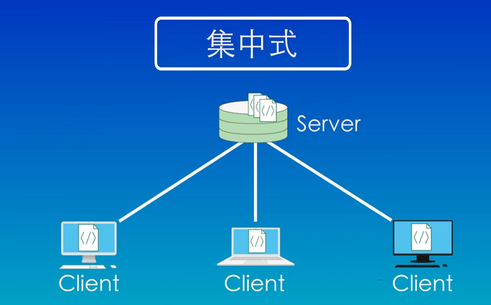
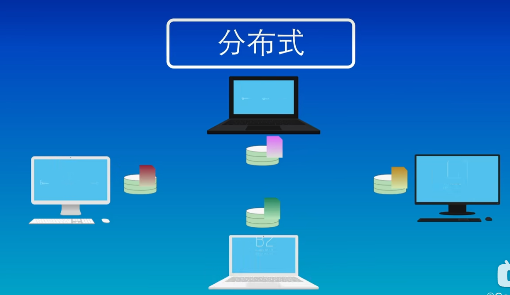

### 1. 什么是git？
git是一个免费开源的分布式版本控制系统，使用一个特殊的叫做仓库(Repository)的数据库来记录文件的变化，仓库中的每个文件都有一个完整的版本历史记录，可以看到谁在哪个时间修改了文件的哪些内容，需要的时候可以及那个文件恢复到之前的某个版本。

### 2. 目前世界上流行的版本控制系统有几种？
(1) 集中式 : SVN、CVS...
(2) 分布式 : GIT...

#### 集中式版本控制系统的流程:

(1) 所有文件都保存在中央服务器上，每个人的电脑(Client)上都有一个文件的副本，当想要修改文件的时候需要从服务器上下载一个最新的版本，修改完之后上传回中央服务器(Server).
(2) 优点: 使用简单
(3) 缺点: 如果中央服务器(Server)或者网络出现故障，所有人则无法工作，只能等回复正常.

#### 分布式版本控制系统的流程:     

(1) 每个人的本地有一套完整的版本库，所以可以在本地进行修改，不需要考虑网络问题。当需要分享自己修改的内容只需要将仓库互相同步一下就可以了.
(2) 优点: 免费、开源、速度快、功能强大、支持离线工作、强大的分支管理
