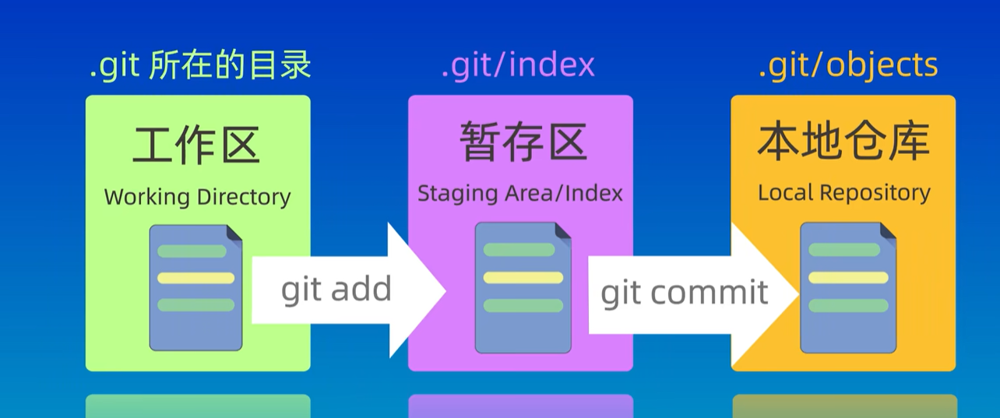
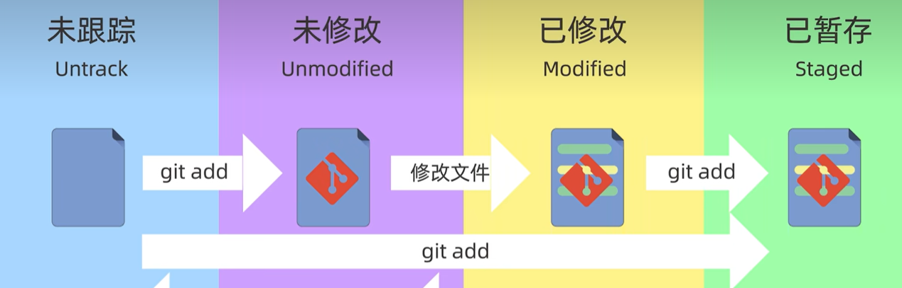

## 1. Git的本地数据管理分为三个区域

### 1.1 工作区

又称为工作目录或本地目录，即我们电脑上的目录，资源管理器里面看到的目录就是工作区。

### 1.2 暂存区

一种临时存储区域，用于保存即将提交到Git仓库的修改内容。

### 1.3 本地仓库

通过 `git init` 命令创建的仓库，包含了完整的项目历史和元数据。

在这个过程中，我们可以使用Git提供的命令来查看、比较或者撤销修改内容，以保证版本控制的准确性和完整性。

## 2. Git中文件的四种状态

### 2.1 未跟踪 (Untracked)

指的是已经创建但还没有被Git管理起来的文件。

### 2.2 未修改 (Unmodified)

已经被Git管理起来，但内容没有发生改变的文件。

### 2.3 已修改 (Modified)

已经修改过但还没有添加到暂存区的文件。

### 2.4 已暂存 (Staged)

修改后已经添加到暂存区内的文件。

)
